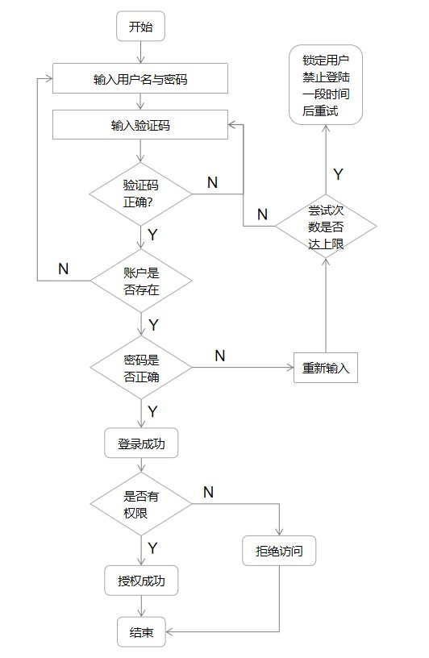
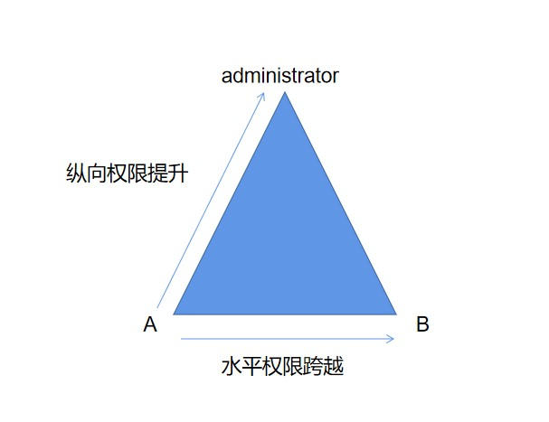

# 操作系统的访问控制设计实例研究

## 实验目的

- 通过 iOS 或Android 系统为研究对象，进行访问控制的理解和设计

## 实验环境

- 操作系统版本:iOS 16.1.2
- 硬件设备型号:iPhone 14 Pro
- 是否默认设置:是

## 实验要求与问题

- 以 iOS系统为研究对象
  - 当系统处于锁屏状态下接收到新短信时，不解锁情况下
    - 系统是否允许查看短信内容？ **是**
    - 系统是否允许回复短信？**否**
  - 当系统处于锁屏状态下，使用系统内置（例如 iOS 的 Siri ）或第三方的语音助手可以完成以下哪些操作？
    - 访问通讯录 ：**不能**
    - 拨打电话：**能**
    - 访问相册：**不能**
    - 查看短信收件箱：**不能**

  - 实验并分析指纹识别相比较于简单密码、复杂密码、图形解锁、人脸识别解锁、声纹解锁等解锁方式的安全性、便利性差异。

    - 安全性
      - 简单密码：一般情况下指纹解锁的安全性是高于简单密码，因为简单密码被暴力破解的可能性较大，而伪造指纹的各方面成本更高。
      - 复杂密码：安全性高于简单密码。
      - 图形密码：简单的图形密码也容易被暴力破解。并且图形密码和简单密码容易被偷窥而破解。
      - 人脸识别解锁：人脸识别的准确率受到许多外部因素的影响，而且人脸本身也会发生一些改变，不排除使用高质量照片解锁的可能性。但经各类实验以及统计数据表明，IOS系统的面部识别安全性高于Android系统。
      - 声纹解锁：人脸识别相似，对外界环境因素的影响很敏感，而且如果使用者声音发生变化（如感冒等），就大大影响了声纹解锁的准确率。
      - 指纹解锁：如人脸识别可能用照片绕过，声纹识别可能被录音绕过，指纹解锁的破译=获取使用者的指纹，而使用者可以在各种地方留下指纹，但复制指纹需要一定的技术手段，因此我认为安全性是中等的
    - 便利性
      - 指纹解锁是非常便利的一种方式（尤其是在后新冠时代下），因为传统密码需要按键输入，图形密码需要在屏幕上划动，人脸识别需要对着摄像头调整好光和角度且没有面部遮挡如口罩，声纹识别对外界声音环境的要求比较苛刻。指纹解锁只需要传感器。
      - 当然，当手指潮湿、指纹磨损、传感器上有污物时，指纹解锁也无法生效。此时，密码解锁不失为一种备用方案。

- 思考题：
  
  - 以上设计实现方式属于我们课堂上讲过的哪种强制访问控制模型？Lattice/BLP？Biba？
  
    **Biba模型**，可以上读下写，锁屏时只能读短信，属于**上读**；解开屏幕以后，可以回复短信，属于**下写**。
  
  - 系统或第三方应用程序是否提供了上述功能的访问控制规则修改？如果修改默认配置，是提高了安全性还是降低了安全性？
  
    **是**，但是第三方应用程序对安全性的影响依赖于用户的设置，如果设置不当安全性就会降低。

## 课后思考题

#### 1.生物特征身份认证方式有哪些？优缺点分析？应用场景举例。

- **指纹识别(Fingerprint recognition)**
- 优点
    - 个体独特性
    - 采集相对容易
    - 进行身份认证时方便快捷
  - 缺点
    - 环境要求很高，对手指的湿度、清洁度等都很敏感
    - 痕迹极易获取，这些留痕可能被非法提取并用于复制指纹
    - 容易被伪造出来，一旦被伪造就难以更改认证
    - 采集指纹需利用传感器，成本高。
  - 应用场景
    - 犯罪痕迹
    - 移动支付的安全认证等
    - 边境控制，机场、港口出入境人员护照、签证等上的身份认证，以及边境检查中进行“黑名单”筛查等
  
- **虹膜识别(iris recognition)**

  - 优点
    - 具有终身不变性，且虹膜信息无法复制
    - 具有非接触性，使用者不需要和设备直接接触就获取了图像，干净卫生，避免了可能发生的疾病接触传染；
    - 错误率相对较低，可靠性高
  - 缺点
    - 用于虹膜识别的硬件设备小型化不容易；
    - 相较于其它生物识别硬件，虹膜识别硬件造价较高，大范围推广困难；
    - 使用便捷性较差，识别准度略低，反应速度较慢。
  - 应用场景
    - 门禁考勤
    - 矿山人员安全管理
    - 司法安检
    - 监考

- **面部识别(face recognition)**

  - 优点 
    - 非接触性，相比较其他生物识别技术而言，人脸识别是非接触的，用户不需要和设备直接接触。
    - 便捷性，验证过程快。
    - 用户接受度高。
    - 普及率较高，大量平台都提供了面部识别认证功能。
  - 缺点

    - 只有比较高级的摄像头才可以有效高速地捕捉面部图像
    - 受光照条件(例如白天和夜晚，室内和室外等)、人脸的很多遮盖物(例如口罩、墨镜、头发、胡须等)、年龄等多方面因素的影响。
    - 人脸存在易变性，人脸的外形很不稳定，人可以通过脸部的变化产生很多表情
  - 应用场景

    - 门禁系统

    - 天眼系统
  - 学生考勤系统
    - 照片检索

- **声音识别(voice recognition)**
- 优点
    - 提取方便
    - 获取语音的识别成本低廉
    - 声纹辨认和确认的算法复杂度低；
    - 配合一些其他措施，如通过语音识别进行内容鉴别等，可以提高准确率
  - 缺点
    - 声音具有易变性，易受身体状况、年龄、情绪等的影响；
    - 不同的麦克风和信道对识别性能有影响；
    - 环境噪音的干扰
  - 应用场景
    - 智能音响
    - 语音拨号
    - 智能家电
    - 语音导航
    - 即时翻译

#### 2.“找回口令功能”和“忘记密码”在访问授权机制中的意义？请尝试设计几种安全的“找回口令功能”，详细描述找回口令的用户具体操作过程。

**意义：** 认证的实现过程就是将主体身份标识唯一的绑定到主体的过程。 身份认证是访问授权的基础。

因为只有通过身份认证后用户才能获得相应的权限。而且如果用户忘记了密码（无法通过认证），就无法获得原先已有的权限。

“找回口令功能”和“忘记密码”实际上是**重置口令**，通过给用户的邮箱发送具有时效性的带有特殊标识的链接，或是给用户手机发送有时效性的验证码/拨打电话提供验证码，完成密码重置。

**安全的“找回口令功能”：** 只要窃取了用户的手机/监视用户的邮箱即可重置用户账户的密码，因此需结合多种手段才能达到相对安全，如:

- 重置密码时用手机短信码来确认身份，然后才允许发送重置链接到用户邮箱；
- 从邮箱点击重置链接后，允许更改密码，但需要回答一个随机的（注册时设置的）安全问题；
- 用户主动发送验证码至特定邮箱/号码，完成身份认证后再进行下一步重置操作。

#### 3.绘制用户使用用户名/口令+图片验证码方式录系统的流程图。考虑认证成功和失败两种场景，考虑授权成功和失败两种场景。

#### 4.Windows XP / 7 中的访问控制策略有哪些？访问控制机制有哪些？

自主访问控制 (Discretionary Access Control, DAC)

- 访问令牌 (access token)
- 安全描述符 (security descriptors)
  - 安全标识 (security identifiers, SID)
  - 访问控制列表 (access control list, ACL)
    - 自主访问控制列表(discretionary access control list, DACL)
      - 访问控制项(access control entries, ACE)
    - 系统访问控制列表(system access control list, SACL)

#### 5.用权限三角形模型来理解并描述下 2 种威胁模型：提权、仿冒。

- 权限三角形模型：用户 - 角色（分级）- 权限（对象+操作）

- 威胁模型描述

  - ##### 提权

    - 提权分为：水平特权提升、垂直特权提升。
    - 提权是指本来没有某项权限的用户，通过一定的方法获得该权限，简而言之，用户以自己的身份获得了本不属于自己的权限。
      - e.g.1 用户A本来只能对一个文件进行查看，但是通过提权获得了对文件修改的权利（垂直提权）。
      - e.g.2 用户A本来只能查看自己的文件，通过提权可以查看B的文件（水平提权）。
    - 提权是用户→角色→权限，角色不变，而获取的权限扩大。

    ##### 仿冒

    - 仿冒是指用户A以用户B的身份通过了认证，之后行使了B所有的权利
    - 仿冒是用户→角色，获取的角色改变，所以能够行使的权限也就因角色的改变而改变了

  

#### 6.试通过操作系统的访问控制机制来达到预防一种真实病毒的运行目的。

可以通过修改**组策略**防止蠕虫病毒，如熊猫烧香.

- 利用自动播放功能；
- 添加注册表自启动；
- 定时关闭特定程序，如杀毒软件、防火墙；
- 删除文件；
- ……

也就是说，如果能根据先验知识限制系统服务的运行、限制文件的操作等，就能有针对性地预防某一病毒

#### 7.什么是 OAuth？

开放授权(OAuth)是一个开放标准/授权协议，而不是身份验证协议。允许用户让第三方应用上访问该用户在某一网站上存储的资源，而无需把用户名和密码提供给第三方应用。

OAuth协议为用户资源的授权提供了一个安全的、开放而又简易的标准。与以往的授权方式不同之处是OAuth的授权不会使第三方触及到用户的帐号信息（如用户名与密码），即第三方无需使用用户的用户名与密码就可以申请获得该用户资源的授权，因此OAuth是“安全的”。同时，任何第三方都可以使用OAuth认证服务，任何服务提供商都可以实现自身的OAuth认证服务，因而OAuth是“开放的”。

常见的授权方式是使用授权码。

#### 8.什么是 OpenID？

OpenID是一个身份认证协议，侧重于确定“用户是谁”，即认证用户所声称的身份是否真实。

OpenID是一个去中心化的网上身份认证系统。对于支持OpenID的网站，用户不需要记住像用户名和密码这样的传统验证标记。取而代之的是，他们只需要预先在一个作为OpenID身份提供者（identity provider, IdP）的网站上注册。OpenID是去中心化的，任何网站都可以使用OpenID来作为用户登录的一种方式，任何网站也都可以作为OpenID身份提供者。

OpenID既解决了问题而又不需要依赖于中心性的网站来确认数字身份。

#### 9.试用本章所学理论分析 0Auth 和 OpenID 的区别与联系。

|          |                            OAuth2                            |                            OpenID                            |
| :------: | :----------------------------------------------------------: | :----------------------------------------------------------: |
| 票据格式 |                          JSON/SAML2                          |                             JSON                             |
| 支持授权 | 支持，OAuth授予第三方应用访问受保护的信息的权限。关注的是授权（Authorization），即：“用户能做什么” | 不支持，OpenID只做身份认证，没有授予权限，它只实现了证明“我是我” |
| 支持认证 | 伪认证，仅需作单纯的身份认证时没必要用到OAuth，用到第三方网站的外部服务时才需使用OAuth |  YES，OpenID关注的是认证（Authentication），即：“用户是谁”   |
| 传输方式 |                             HTTP                             |                    HTTP GET and HTTP POST                    |
| 安全弱点 | 不能抵抗网络钓鱼，OAuth没有使用数据签名和加密等措施，数据安全完全依赖TLS | 不能抵抗网络钓鱼，一个钓鱼的IDP如果恶意记录下来用户的OpenID，将会造成很严重的隐私安全问题 |
| 使用场景 |                           API授权                            |                      商用应用的单点登录                      |

- 联系

  - 两者都可以用来实现用户验证和用户授权，因为，两者本质上都是用来获取断言的方法（assertion verification method），都可以通过url重定向返回断言， 而用户身份和用户权限本质上都是断言，用户身份是关于“用户是谁”，用户权限是关于“用户可以操作什么”
  - OAuth2是OpenID-Connect的基础（在OpenID-Connect中，ID-Token也被当做是一种资源）

  

#### 10.如何使用 OAuth 和 OpenID 相关技术实现单点登录（Single Sign On）？

**单点登录 (SSO)** 是一种对于许多相互关连，但是又是各自独立的软件系统，提供访问控制的属性。当拥有这项属性时，当用户登录时，就可以获取所有系统的访问权限，不用对每个单一系统都逐一登录。

**微软账户就是一个单点登录微软账户**，使微软用户登录微软网站（如Outlook），运行在微软操作系统的设备（如Windows10电脑/平板、WindowsPhone、Xbox），微软应用软件（如Visual Stdio）。

微软的网站，服务，应用程序都可以使用同一个微软账户登录，而不需要多个账户。

也就是说，**单点登录的实现是发生在服务器之间**，如登录Outlook，用户身份的确认是由微软账户认证服务器实现，而不是Outlook服务器。

## 参考资料

- [Lychee](https://github.com/CUCCS/2021-ns-public-Lychee00/tree/main)
- [OAuth Wiki](https://en.wikipedia.org/wiki/OAuth)
- [OpenID Wiki](https://en.wikipedia.org/wiki/OpenID)
- [A picture to get OAuth2.0](https://www.cnblogs.com/flashsun/p/7424071.html)