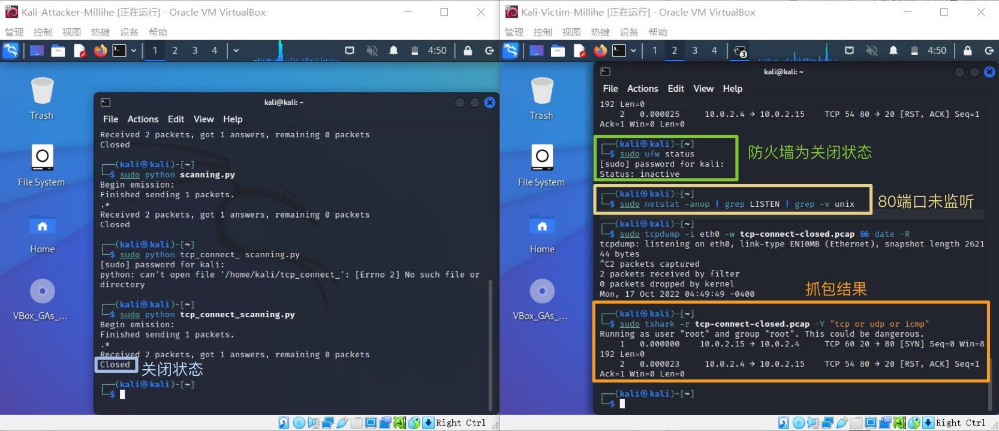
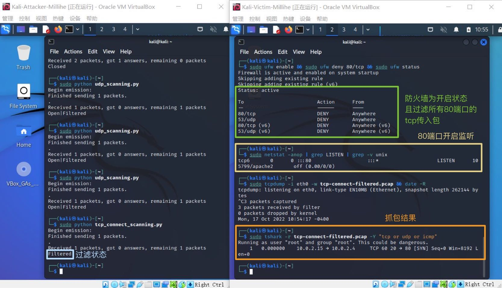

# 基于 Scapy 编写端口扫描器

## 实验目的

- 掌握网络扫描之端口状态探测的基本原理

## 实验环境

- python + scapy

## 实验要求

- - [x] 禁止探测互联网上的 IP ，严格遵守网络安全相关法律法规
- - [x] 完成以下扫描技术的编程实现

  - TCP connect scan / TCP stealth scan
  - TCP Xmas scan / TCP fin scan / TCP null scan
  - UDP scan
- - [x] 上述每种扫描技术的实现测试均需要测试端口状态为：`开放`、`关闭` 和 `过滤` 状态时的程序执行结果
- - [x] 提供每一次扫描测试的抓包结果并分析与课本中的扫描方法原理是否相符？如果不同，试分析原因；
- - [x] 在实验报告中详细说明实验网络环境拓扑、被测试 IP 的端口状态是如何模拟的
- - [ ] （可选）复刻 `nmap` 的上述扫描技术实现的命令行参数开关

## 实验步骤

### 网络拓扑


### 防火墙及端口状态设置

|   状态   | 对应端口 | 防火墙 |
| :------: | :------: | :----: |
| 关闭状态 |  不监听  |  关闭  |
| 开启状态 |   监听   |  关闭  |
| 过滤状态 |   监听   |  开启  |

- 防火墙

  ```shell
  # 查看当前防火墙状态和规则
  $ sudo ufw status
  
  # 关闭防火墙
  $ sudo ufw disable
  
  # 开启防火墙
  $ sudo ufw enable
  
  # 拒绝端口上的特定传入数据包以达到过滤效果
  $ sudo ufw deny 80/tcp 
  $ sudo ufw deny 53/udp
  ```

- 对应端口

  apache 2基于TCP，在80端口提供服务；DNS服务基于UDP，在53端口提供服务

  ```shell
  # 查看当前端口状态
  $ sudo netstat -anop | grep LISTEN | grep -v unix
  
  # 监听开启
  $ sudo systemctl start apache2 # port 80
  $ sudo systemctl start dnsmasq # port 53
  
  # 监听关闭
  $ sudo systemctl stop apache2 # port 80
  $ sudo systemctl stop dnsmasq # port 53
  ```

### 抓包操作代码

注意安装tcpdump

```shell
# 开启抓包
$ sudo tcpdump -i eth3 -w .pcap && date -R

# 对抓包结果进行分析
$ sudo tshark -r tcp-cnt-3.pcap -Y "tcp or udp or icmp"
```

### TCP connect scan

直接连到目标端口并完成一个完整的3次握手过程(SYN、SYN/ACK和ACK)，根据“connect()”函数是否调用成功判断端口是否处于侦听状态。即先发送一个S，然后等待回应。如果有回应且标识为RA，说明目标端口处于关闭状态；如果有回应且标识为SA，说明目标端口处于开放状态。这时TCP connect scan会回复一个RA，在完成三次握手的同时断开连接.

**code**

```python
from scapy.all import *


def tcpconnect(dst_ip, dst_port, timeout=10):
    pkts = sr1(IP(dst=dst_ip)/TCP(dport=dst_port,flags="S"),timeout=timeout)
    if pkts is None:
        print("Filtered")
    elif(pkts.haslayer(TCP)):
        if(pkts.getlayer(TCP).flags == 0x12):  #Flags: 0x012 (SYN, ACK)
            send_rst = sr(IP(dst=dst_ip)/TCP(dport=dst_port,flags="AR"),timeout=timeout)
            print("Open")
        elif (pkts.getlayer(TCP).flags == 0x14):   #Flags: 0x014 (RST, ACK)
            print("Closed")

tcpconnect('10.0.2.4', 80)
```

- 端口关闭：

  

- 端口开放：

  

- 端口过滤：

  


### TCP stealth scan

先发送一个S，然后等待回应。如果有回应且标识为RA，说明目标端口处于关闭状态；如果有回应且标识为SA，说明目标端口处于开放状态。这时TCP stealth scan只回复一个R，不完成三次握手，直接取消建立连接。

**code**

```python
from scapy.all import *


def tcpstealthscan(dst_ip, dst_port, timeout=10):
    pkts = sr1(IP(dst=dst_ip)/TCP(dport=dst_port, flags="S"), timeout=10)
    if (pkts is None):
        print("Filtered")
    elif(pkts.haslayer(TCP)):
        if(pkts.getlayer(TCP).flags == 0x12):
            send_rst = sr(IP(dst=dst_ip) /
                          TCP(dport=dst_port, flags="R"), timeout=10)
            print("Open")
        elif (pkts.getlayer(TCP).flags == 0x14):
            print("Closed")
        elif(pkts.haslayer(ICMP)):
            if(int(pkts.getlayer(ICMP).type) == 3 and int(stealth_scan_resp.getlayer(ICMP).code) in [1, 2, 3, 9, 10, 13]):
                print("Filtered")


tcpstealthscan('10.0.2.4', 80)
```

- 端口关闭：

  

- 端口开放：

  

- 端口过滤：

  

### TCP Xmas scan

根据端口是否回应RST数据包判定端口状态。TCP连接结束时,会向TCP端口发送一个设置了FIN位的连接终止数据报包，关闭的端口会回应一个设置了RST的连接复位数据包；而开放的端口则会对这种可疑的数据报不加理睬,将它丢弃。

**code**

```python
from scapy.all import *


def Xmasscan(dst_ip, dst_port, timeout=10):
    pkts = sr1(IP(dst=dst_ip)/TCP(dport=dst_port, flags="FPU"), timeout=10)
    if (pkts is None):
        print("Open|Filtered")
    elif(pkts.haslayer(TCP)):
        if(pkts.getlayer(TCP).flags == 0x14):
            print("Closed")
    elif(pkts.haslayer(ICMP)):
        if(int(pkts.getlayer(ICMP).type) == 3 and int(pkts.getlayer(ICMP).code) in [1, 2, 3, 9, 10, 13]):
            print("Filtered")


Xmasscan('10.0.2.4', 80)
```

- 端口关闭：

  

- 端口开放：

  

- 端口过滤：

  


### TCP FIN scan

与Xmas扫描较为相似，根据端口是否回应RST数据包判定端口状态，但仅发送FIN包。收到RST包说明端口处于关闭状态；否则为开启/过滤状态。

**code**

```python
from scapy.all import *


def finscan(dst_ip, dst_port, timeout=10):
    pkts = sr1(IP(dst=dst_ip)/TCP(dport=dst_port, flags="F"), timeout=10)
    if (pkts is None):
        print("Open|Filtered")
    elif(pkts.haslayer(TCP)):
        if(pkts.getlayer(TCP).flags == 0x14):
            print("Closed")
    elif(pkts.haslayer(ICMP)):
        if(int(pkts.getlayer(ICMP).type) == 3 and int(pkts.getlayer(ICMP).code) in [1, 2, 3, 9, 10, 13]):
            print("Filtered")


finscan('10.0.2.4', 80)
```

- 端口关闭：

  

- 端口开放：

  

- 端口过滤：

  


### TCP NULL scan

与Xmas扫描、fin扫描均较为相似，根据端口是否回应RST数据包判定端口状态，发送的包中关闭所有TCP报⽂头标记。收到RST包说明端口处于关闭状态；否则为开启/过滤状态。

**code**

```python
from scapy.all import *


def nullscan(dst_ip, dst_port, timeout=10):
    pkts = sr1(IP(dst=dst_ip)/TCP(dport=dst_port, flags=""), timeout=10)
    if (pkts is None):
        print("Open|Filtered")
    elif(pkts.haslayer(TCP)):
        if(pkts.getlayer(TCP).flags == 0x14):
            print("Closed")
    elif(pkts.haslayer(ICMP)):
        if(int(pkts.getlayer(ICMP).type) == 3 and int(pkts.getlayer(ICMP).code) in [1, 2, 3, 9, 10, 13]):
            print("Filtered")


nullscan('10.0.2.4', 80)
```

- 端口关闭：

  

- 端口开放：

  

- 端口过滤：

  


### UDP scan

一种开放式扫描，通过发送UDP包进行扫描。当收到UDP回复时，该端口为开启状态；否则即为关闭/过滤状态.

**code**

```python
from scapy.all import *


def udpscan(dst_ip, dst_port, dst_timeout=10):
    resp = sr1(IP(dst=dst_ip)/UDP(dport=dst_port), timeout=dst_timeout)
    if (resp is None):
        print("Open|Filtered")
    elif (resp.haslayer(UDP)):
        print("Open")
    elif(resp.haslayer(ICMP)):
        if(int(resp.getlayer(ICMP).type) == 3 and int(resp.getlayer(ICMP).code) == 3):
            print("Closed")
        elif(int(resp.getlayer(ICMP).type) == 3 and int(resp.getlayer(ICMP).code) in [1, 2, 9, 10, 13]):
            print("Filtered")
        elif(resp.haslayer(IP) and resp.getlayer(IP).proto == IP_PROTOS.udp):
            print("Open")


udpscan('10.0.2.4', 53)
```

- 端口关闭：

  

- 端口开放：

  

- 端口过滤：

  

## 实验总结

1. 扫描方式与端口状态

   |       扫描方式/端口状态       |              开放               |      关闭       |      过滤       |
   | :---------------------------: | :-----------------------------: | :-------------: | :-------------: |
   |   TCP connect / TCP stealth   | 完整的三次握手，能抓到ACK&RST包 |  收到一个RST包  | 收不到任何TCP包 |
   | TCP Xmas / TCP FIN / TCP NULL |         收不到TCP回复包         |  收到一个RST包  | 收不到TCP回复包 |
   |              UDP              |          收到UDP回复包          | 收不到UDP回复包 | 收不到UDP回复包 |

2. 由抓包结果截图可知，每一次扫描测试的抓包结果与课本中的扫描方法原理**相符**。


## 参考资料

- [ufw的使用](https://blog.csdn.net/qq_45928255/article/details/122644336)
- [Lychee](https://github.com/CUCCS/2021-ns-public-Lychee00/tree/chap0x05)
- [Scapy说明书](https://scapy.readthedocs.io/en/latest/)
- [端口状态改变](https://blog.csdn.net/weixin_34357614/article/details/116952443)